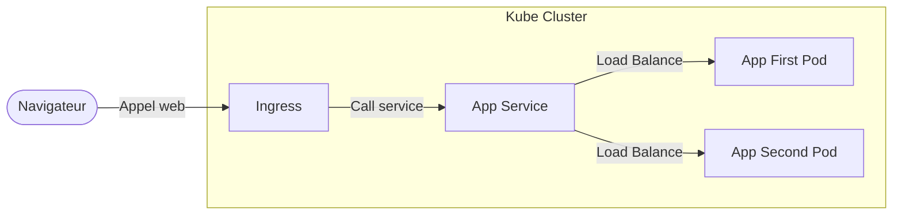

Kubernetes, Nomad, Openshift, ils se font appeler sous pleins de noms mais restent 
un mystère pour beaucoup de monde. 

L'objectif avec cet article est de démystifier tout cela et comprendre ce qu'est un orchestrateur,
à quoi il sert, comment il fonctionne et à quelles problématiques on cherche à répondre avec.

> Pré-requis: Connaître le vocabulaire docker, conteneur / image

## Tout commence dans un entrepôt 

Commençons simplement, imaginons un entrepôt dans lequel on dépose des colis sur des étagères.

- Chaque colis possède un poids et un volume;
- Chaque étagère possède un poids et un volume maximal qu'elle peut accueillir;
- Les colis n'ont rien d'unique et sont associés à une référence produit en fonction de leur contenu, 
deux colis peuvent donc avoir une référence produit commune.

Le but du jeu est de répartir nos colis sur l'ensemble des étagères de notre entrepôt 
en respectant les contraintes suivantes:

- La somme des poids des colis sur une même étagère ne doit pas dépasser le poids maximal supporté par l'étagère;
- La somme des volumes des colis sur une même étagère ne doit pas dépasser le volume maximal supporté par l'étagère;
- Tous les colis d'une même référence produit ne doivent pas être sur la même étagère.

On pourrait également rajouter des contraintes un peu personnalisées, par exemple une étagère pourrait ne prendre que les colis bleus.

Une fois nos colis bien placés, les employés de l'entrepôt doivent pouvoir les retirer (pour charger un camion par exemple),
pour une référence produit donnée nous devons donc être capable de donner l’ensemble des étagères sur lesquelles 
les colis correspondant ont été placés dans l'entrepôt afin qu'un employé puisse en choisir un à retirer.

Nous devrons également assurer une disponibilité permanente, une référence produit est 
associée à un certains nombre de colis à positionner dans l'entrepôt, le nombre de colis 
disponible dans l'entrepôt doit toujours rester le même et si un colis est retiré d'une étagère 
nous devons alors réapprovisionner notre entrepôt en quantité nécessaire pour avoir le bon nombre de colis.

## Ok t'es gentil, mais les orchestrateurs dans tout ça ?!

Et bien ce que vous avez fait avec l'entrepôt c'est exactement ce qu'un orchestrateur va faire avec notre parc applicatif.

Dans votre cluster (*entrepôt*):

- Notre application (*référence produit*) requiert des resources cpu et ram pour fonctionner (*poids et volumes*);
- Chaque nodes/nœuds/servers (*étagère*) de notre cluster, possède une certaine quantité de cpu et de ram disponible;
- Pour chaque application on déploie un conteneur (*colis*) sur plusieurs nœuds en suivant les mêmes contraintes de l'entrepôt;
- Quand l'on souhaite appeler noter application il faut savoir où rediriger notre requête pour qu'elle soit traitée par le conteneur correspondant;
- Le nombre de conteneur déployé pour notre application est défini en amont et doit toujours être le même.

> Par confort j'ai fait un raccourci en disant "Une application = Un conteneur", 
> mais une application peut très bien correspondre à plusieurs conteneurs travaillant de concert.

## Exemple avec Kubernetes

### La théorie

Pour travailler avec Kubernetes il faut désormais se plonger un peu plus dans son fonctionnement

Le schéma ci-dessous montre ce qu'il se passe lorsque que depuis notre navigateur web nous faisons un appel à une application déployée au sein d'un cluster Kubernetes.



Au niveau du Cluster Kubernetes on retient les 3 termes suivants

- `Ingress`
- `Service`
- `Pod`

Le `pod` pour reprendre l'exemple de l'entrepôt correspond à notre *colis*, 
c'est le pod qui contient les conteneurs faisant tourner votre application.
Pour votre application vous avez le choix de déployer autant de pod que vous
souhaitez (on parle de `replicas`)

Le `service` est une entité propre à Kube qui va se charger de dispatcher l'ensemble
des appels envoyés à votre application sur tous les pods de votre application 
que vous aurez déployé.

Avant de continuer, il faut préciser que tous vos pods et services sont coupés du monde 
extérieur et ne peuvent pas être appelé directement. 

C'est là que l'`ingress` entre en jeu, l'ingress est un pod particulier 
pouvant écouter le traffic de l'extérieur et dont le rôle est de 
le redistribuer aux services à l'intérieur du cluster.


### Demo

#### Présentation de notre application

Pour notre exemple nous considérons une simple api python.

- L'api écoute sur le port 8080;
- Au démarrage de l'api on génère un identifiant d'instance unique propre à notre api;
- On expose un endpoint `/api/v1/sum/<num1>/<num2>` qui retourne dans un json la somme de num1 et num2 et l'identifiant d'instance de notre api.

Pour `/api/v1/sum/5/7` si l'identifiant d'instance de l'api est `noether-23031882` le résultat sera

```json
{
  "result": "12",
  "instance_id": "noether-23031882"
}
```

Le code de cet api avec son dockerfile est disponible [ici](https://github.com/noether-blog/python-sum-api)

Après avoir cloné le projet, nous construisons une image docker de notre application python

```bash
docker build -t sum-api:v1.0.0 .
```

Nous avons maintenant une image de notre application dont nous pouvons lancer un conteneur avec la commande suivante

```bash
docker run --rm -p 8080:8080 sum-api:v1.0.0
```

Dans un terminal à part on lance la commande

```bash
curl http://localhost:8080/api/v1/sum/15/23` 
```

Et l'on observe le résultat suivant (votre `instance_id` doit être différent du miens)

```json
{
  "instance_id": "WChAEYJMLzhOnzQGI1J2d8xQ8",
  "result": "38"
}
```

L'instance id est une chaîne de caractère générée aléatoirement par l'application qui sera toujours la même pour cette instance.

Dans un nouveau terminal nous lançons un nouveau conteneur de notre api mais cette fois sur le port 4200

```bash
docker run --rm -p 4200:8080 sum-api:v1.0.0
```

Nous appelons ensuite la même api sur ce nouveau conteneur

```bash
curl http://localhost:4200/api/v1/sum/15/23
```

Et obtenons donc un nouveau `instance_id`.

```json
{
  "instance_id": "XlC7sbAJI4FnS4NLi4C1KuP4P",
  "result": "38"
}
```

On peut couper les conteneurs (`Ctrl + C` dans le terminal associé) si vous avez suivi mes commandes ils seront supprimés automatiquement

#### Mise en place de notre cluster Kubernetes

Kubernetes étant un très gros logiciel, on ne peut pas directement travailler avec sans mettre ses ressources pc à mal, 
nous allons donc utiliser une version lite de celui-ci adapté pour desktop, j'ai nommé [k3s](https://k3s.io/), 
rendez vous sur le site et suivez la procédure d'installation.

Nous avons désormais avoir un service `k3s` qui tourne sur notre machine, il est consultable via la commande suivante

```bash
sudo systemctl status k3s.service
```

Nous allons devoir modifier un petit peu le service k3s pour travailler avec afin qu'il soit capable de retrouver
l'image docker de notre api python. 

Pour il faut éditer tant qu'administrateur le fichier suivant `/etc/systemd/system/k3s.service`

À la dernière ligne, on rajoute `--docker` comme suit, on indique ainsi à k3s d'utiliser notre docker comme moteur de conteneur

```
ExecStart=/usr/local/bin/k3s \
    server \
    --docker
```

Il nous faut alors recharger la configuration du service puis le redémarrer.

```bash
sudo systemctl daemon-reload
sudo systemctl restart k3s.service
```

> Les commandes qui suivent sont à lancer avec `sudo`

Une fois l'installation terminée nous créons un namespace `noether` dans lequel travailler

```bash
kubectl create namespace noether
```

> Un namespace est un cloisonnement interne à Kube dans lequel on choisi de ranger nos applications

#### Déploiement de notre application - Pod et Deployment

> Petit rappel de vocabulaire, dans Kubernetes notre application tourne dans un `pod`

Pour créer un pod Kubernetes possède un objet nommé `deployment` qui est un descriptif 
de comment créer un pod que Kubernetes utilisera, 
si nous souhaitons faire tourner notre application 
il faut donc créer un déploiement pour notre image docker.

> Ami·es développeur·se vous pouvez facilement faire un parallèle avec la programmation objet ici, 
> le deployment serait une classe et le pod l'objet instancié

La commande suivante nous permettra de voir à quoi ressemble un `deployment`, le paramètre `--dry-run=client` indique à Kube de ne rien opérer

```bash
kubectl create deployment py-sum-api --image=sum-api:v1.0.0 --dry-run=client -o yaml -n noether
```

Nous sauvegardons ce yaml en rajoutant `> manifest-deployment.yaml` à la suite de votre commande

```bash
kubectl create deployment py-sum-api --image=sum-api:v1.0.0 --dry-run=client -o yaml -n noether > manifest-deployment.yaml
```

Le manifest est disponible [ici](https://github.com/noether-blog/python-sum-api/blob/main/k3s/manifest-deployment.yaml) 

Pour déployer notre application on a désormais deux commandes possibles

```bash
kubectl create deployment py-sum-api --image=sum-api:v1.0.0 -o yaml -n noether
kubectl apply -f manifest-deployment.yaml
```

Une fois une de ces deux commandes lancées nous pouvons consulter notre déploiement 
et le pod qui a été créé à l'aide des deux commandes suivantes

```bash
kubectl get deployment -n noether # Va nous afficher la liste des déploiements
kubectl get pods -n noether # Va nous afficher la liste des pods
```

> Si vous n'êtes pas à l'aise avec la ligne de commande je vous invite à regarder le logiciel [lens](https://k8slens.dev/)

Ici notre déploiement n'a créé qu'un seul pod mais pour notre démo on aimerait en avoir deux

Dans `manifest-deployment.yaml` nous nous intéressons au paramètre `spec.replicas`, 
ce paramètre indique à Kube combien de pods il doit créer

```yaml
spec:
  progressDeadlineSeconds: 600
  replicas: 1
  revisionHistoryLimit: 10
```

On édite le manifest pour passer le nombre de replicas à deux et on apply de nouveau le manifest

```bash
kubectl apply -f manifest-deployment.yaml -n noether
```

> On aurait également pu utiliser la commande `kubectl edit deployment py-sum-api` pour faire l'édition en live

En relançant la commande `kubectl get pods -n noether` nous aurons un résultat similaire à celui-ci

```
NAME                          READY   STATUS    RESTARTS   AGE
py-sum-api-5779b44f4b-65bxr   1/1     Running   0          87s
py-sum-api-5779b44f4b-2bmm6   1/1     Running   0          45s
```

Nous aimerions désormais pouvoir accéder à ces pods via notre navigateur.

#### Déploiement de notre application - Les Services

Dans Kubernetes les pods sont complètements isolés du monde extérieur, et n'ont pas de possibilité 
d'être appelé directement, d'autant plus que si c'était le cas, comment savoir lequel vous allez appelé ? 
C'est là que les `services` entre en jeu.

Le `service` est une entité Kube qui (dixit la doc) *définit un ensemble logique de pod ainsi que des règles pour y accéder*.

Le `service` se place donc devant l'ensemble de vos pods et se charge de dispatcher le traffic dessus selon des règles établies.

Notre service comme un deployment peut être représenter par un manifest yaml, 
on peut le consulter avec la commande suivante, comme précédemment le `--dry-run=client` ne vas pas exécuter la commande

```bash
kubectl expose deployment/py-sum-api --type="NodePort" --port 8080 --dry-run=client -o yaml -n noether
```

On sauvegarde ce manifest en rajoutant `> manifest-service.yaml` à la suite de la commande

```bash
kubectl expose deployment/py-sum-api --type="NodePort" --port 8080 --dry-run=client -o yaml -n noether > manifest-service.yaml
```

> Nous reviendrons sur le NodePort après.

Et nous utilisons donc la commande apply pour créer notre `service`

```bash
kubectl apply -f manifest-service.yaml -n noether
```

Une fois les services créés, il nous est possible de les lister avec la commande `kubectl get services -n noether`

```
NAME         TYPE       CLUSTER-IP     EXTERNAL-IP   PORT(S)          AGE
py-sum-api   NodePort   XX.YY.ZZ.ABC   <none>        8080:30784/TCP   3m2s
```

Si on récupère la `Cluster-ip` de notre service et que l'on se rend dans notre navigateur sur l'url `http://xx.yy.zz.abc:8080/health`

On obtient le json suivant, correspondant au [endpoint](https://github.com/noether-blog/python-sum-api/blob/main/app.py#L14) `/health` de notre api python

```json
{
  "status": "ok"
}
```

En appelant l'url suivante plusieurs fois `http://xx.yy.zz.abc:8080/api/v1/sum/15/7`

Nous obtenons deux résultats différents, voici ceux que j'ai chez moi

```json
{
  "instance_id": "B6mG03Ptg9nbWylnf72d9uIMs",
  "result": "22"
}
```
```json
{
  "instance_id": "AcDk7Y8M3VA12keqaKWf90taz",
  "result": "22"
}
```

On constate que l'`instance_id` est différent c'est parque le service a dispatché l'appel http sur les deux pods, l'`instance_id`
étant par construction différent pour chaque pod on constate ainsi que les réponses ne sont pas faites par le même service, 
ce qui conclue notre démonstration sur le fonctionnement de Kubernetes et de comment le traffic entrant est dispatché sur les différentes instances de notre application

---

### Apparté sur le NodePort et L'ingress

Je vous ai parlé du `NodePort` un service de type NodePort va exposer le port 8080 du nœud sur lequel tournent les pods directement au monde extérieur.

Ce n'est pas spécialement une bonne pratique que d'exposer tous les nodes de son cluster à l'extérieur, 
on préféra utiliser des services de type `ClusterIP` rendant les pods accessibles uniquement depuis l'intérieur du cluster

Pour exposer à l'extérieur vous aurez donc un seul service de type `NodePort` qui recevra tout le traffic en entrée pour le transmettre à un pod qui sera alors
chargé de dispatcher le traffic à tous les autres services du cluster. On parle alors de ce pod comme étant un `ingress`.

---

## Pourquoi fait on ça ?

Une des raisons est que nos pods dans le cadre d'un cluster vont être déployés sur des machines différentes

Cela vous permet donc plusieurs choses:

- Assurer la résilience de notre application, si un nœud doit redémarrer pour maintenance, les autres
sont toujours là pour assurer le boulot
- Déployer une nouvelle version de notre application, en déployant les pods un par un, pendant que l'un est mise à jour l'autre assure le boulot et une fois la mise à jour terminée c'est au tour du pod suivant d'être mis à jour pendant que le pod mis à jour assure le boulot.

De même le fait d'avoir plusieurs pods vous permet d'assurer des traitements en parallèle du traffic entrant.

## Contraintes de développement

Avoir l'ensemble de son infrastructure tournant sur un orchestrateur implique en conséquence
de se poser plusieurs questions quant à notre façon de développer et de concevoir notre système.

Certains choix d'architecture peuvent se faire par confort (event driven, micro-service) mais
ne sont en rien une obligation.

Partant du principe que application tourne sur plusieurs nœuds, cela veut dire que sur deux appels consécutifs
le traitement pourra se retrouver sur deux nœud différents; auquel cas le deuxième traitement n'aura pas de connaissance
directe de ce qu'à fait le premier traitement.

La plus grande contrainte à respecter est donc de penser vos applications en stateless, votre application doit être capable
lorsqu'elle reçoit un appel de déterminer l'ensemble des infos qui ont amené cet appel sans connaître le passé.

## Conclusion

C'en est fini pour cet article sur les orchestrateurs, j'espère qu'il vous aura permis de démystifier 
le sujet et d'y voir un peu plus clair sur le fonctionnement de ces outils.

L'exemple est centré sur Kubernetes car c'est l'un des plus populaires, mais on retrouve le même principe sur les autres.


## Source pour cet article

[la documentation Kubernetes](https://kubernetes.io/docs/home/)
