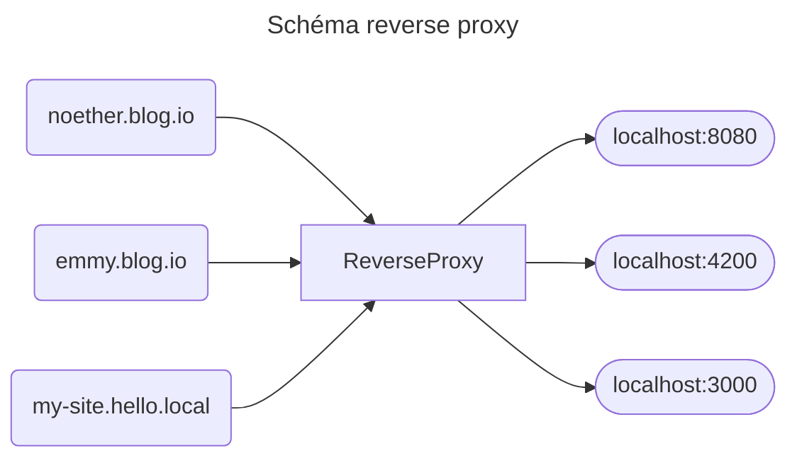

*localhost* ! Toute personne ayant déjà développé un site web ou une api connaîtra ce mot, il représente le host par défaut de votre machine, l'ip 127.0.0.1 !

Mais est ce que vous ne trouvez pas ça dommage ? 

Je veux dire que l'ensemble de vos sites web sur votre machine soit tous sur localhost ? 

Pourquoi un nom si fade et pas un peu de fantaisie ? Pourquoi devoir toujours renseigner le port derrière `localhost:8080` ?

Dans cet article je vous montre comment personnaliser tout ça et pouvoir appeler votre site avec un hostname personnalisé.

## C'est quoi un hostname ?

Je ne suis pas le mieux placé pour vous parler de réseau mais je vais essayer de rester clair.

Votre ordinateur est identifié est représenté par une ip, cette ip est différente en fonction de là où on se situe. 
J'entends par là que votre ordinateur ainsi que celui sur lequel j'écris ces lignes se reconnaissent tout les deux par 127.0.0.1 et pourtant ce ne sont pas les mêmes machines.

Et des ips il en existe plein, et soyons réaliste si on devait toutes les retenir on ne s'en sortirait pas, on a donc eu besoin d'un meilleur système, les hostnames.

Un hostname c'est une étiquette que nous allons apposer sur une ip pour qu'elle soit reconnaissable par un humain, ainsi *localhost* est le hostname de l'ip *127.0.0.1*.

De la même manière *noether-blog.github.io* correspond au hostname de l'ip d'une machine chez github sur laquelle est hébergée ce blog.

Pour repérer à quel ip correspond un hostname votre ordinateur va regarder sur un server dns qui vous donnera l'ip correspondante (pour savoir quel server dns votre ordinateur appelle vous pouvez utiliser la commande `cat /etc/resolv.conf`).

## Mais localhost ?

Effectivement, `localhost` n'est pas résolu par un server dns mais est propre à votre machine, ces hosts sont définis dans le fichier `/etc/hosts`.

Avec la commande `cat /etc/hosts` vous aurez un résultat similaire à celui-ci

```
127.0.0.1	localhost
::1	localhost ip6-localhost ip6-loopback
fe00::0	ip6-localnet
ff00::0	ip6-mcastprefix
ff02::1	ip6-allnodes
ff02::2	ip6-allrouters
172.17.0.2	39ad6355b8ad
```

Seule la première ligne nous intéresse, celle-ci nous permet de dire à notre ordinateur 
que lorsque nous appelons `localhost` il doit nous rediriger sur l'ip `127.0.0.1`

Si maintenant vous décider de rajouter une ligne dans `/etc/hosts` (il faut l'ouvrir en admin)

```
127.0.0.1 noether.blog.io
```

Et que vous rentrez l'url `http://noether.blog.io/` dans votre navigateur, et viens vous serez redirigé sur l'ip `127.0.0.1` 

---
### Démo

Dans un nouveau dossier, créez une page `index.html` basique avec un `Hello world` dedans: `echo 'Hello World' > index.html`

Ouvrez un terminal dans ce dossier et tapez la commande `python -m http.server 4200`

Rendez vous sur `http://noether.blog.io:4200/` vous verrez alors notre `Hello World`

Faites `Ctrl+C` dans vos terminaux pour couper les servers python.
---

Ainsi en rajoutant des lignes dans votre fichier `/etc/hosts` vous pouvez définir des domaines personnalisés qui ne fonctionneront que sur votre environnement de travail, classe non ?

## Ok mais le port ?

Alors oui vous l'avez vu dans la démo, changer le hosts implique de quand même devoir renseigner le port au moment de l'appel.

Tout d'abord on ne se débarrassera jamais réellement du port, si vous avez 4 sites web + 2 apis, il vous faudra 6 ports.

Mais! On peut le cacher, c'est un poil tricky à faire mais c'est faisable, et pour cela il nous faut un reverse proxy.

Par défaut quand vous ne renseignez pas de port dans votre lien, c'est le port 80 qui sera appelé.

Un reverse proxy est un logiciel qui permet de capter du traffic entrant sur un seul port de votre machine pour ensuite le rediriger
sur d'autre port de votre machine en fonction du hostname avec lequel il est appelé.



*Sur ce schéma, le reverse proxy redirige le traffic entrant sur le port 8080 vers les ports 8080, 4200 et 3000*

Plusieurs logiciels permettent cela, les deux plus connu étant `nginx` et `httpd` (connu également sous le nom `apache`). Ils ne sont pas bien compliqué à configurer mais cela peut prendre un peu de temps et fera l'objet d'un article dédié.


